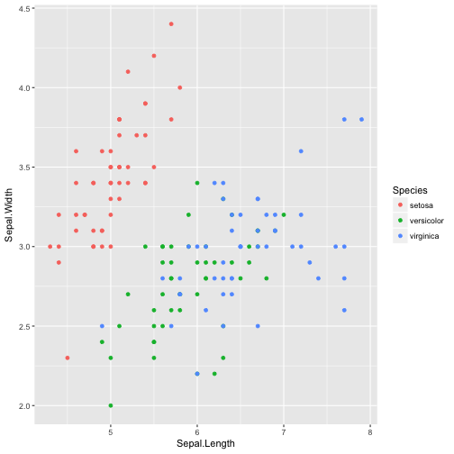

How did they make that? : R and visualization for science
========================================================
author: Todd Suomela
date: 2017-04-06
autosize: true


Introducing R and ggplot
========================================================


R is a statistical software programming environment that can be used across disciplines to visualize many different types of data.

You can add functions to the base R system by installing packages.

ggplot2 is one of the most popular packages for creating data visualizations

- use your package manager to install ggplot
- [ggplot2 documentation](http://docs.ggplot2.org/current/)


ggplot concept
========================================================

ggplot is built around the idea of building a plot with layers

- aesthetics
- geoms
- statistics
- coordinates and facets
- themes

aesthetics
========================================================

The aesthetics layer is required and contains the basic mapping between data and visual scales.


```r
p <- ggplot(iris, 
            aes(x = Sepal.Length,
                y = Sepal.Width,
                color = Species))
```


geoms
=========================


```r
p + geom_point()
```



available mappings
========================

- x
- y
- colour
- fill
- size
- alpha
- linetype
- labels
- shape

****

- X axis position
- Y axis position
- color of dots, outlines of other shapes
- fill color
- diameter of points, thickness of lines
- transparency
- line, dash, pa, ern
- text on plot or axes
- shape


statistics
=========================

coordinates and facets
=========================

themes
=========================
